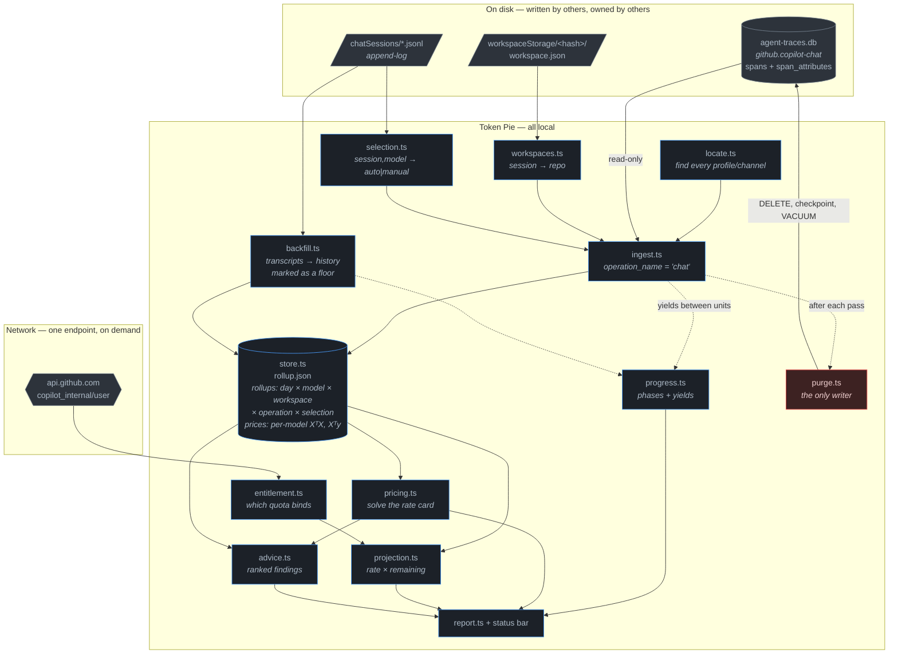
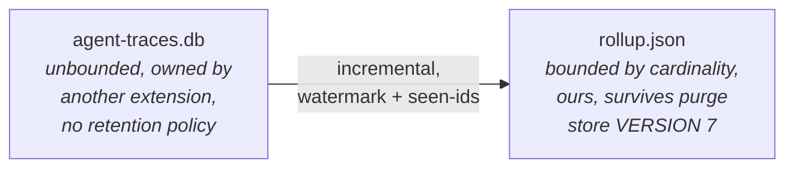
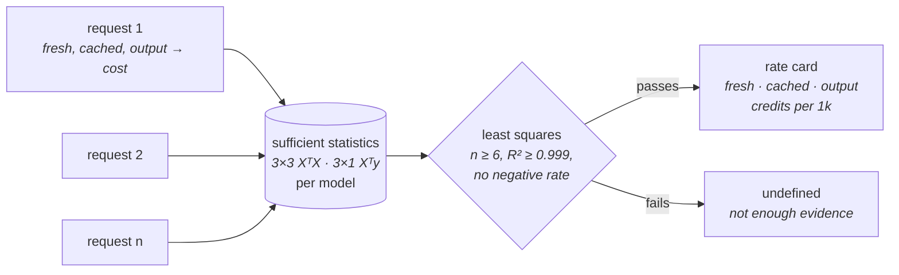
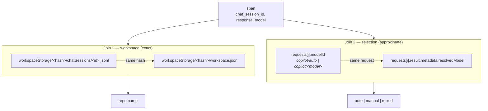
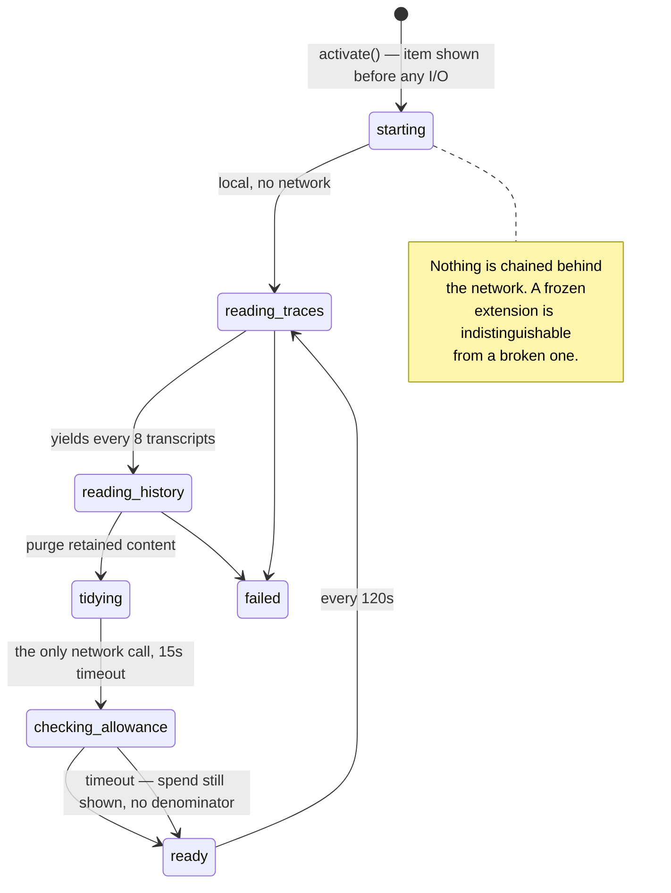
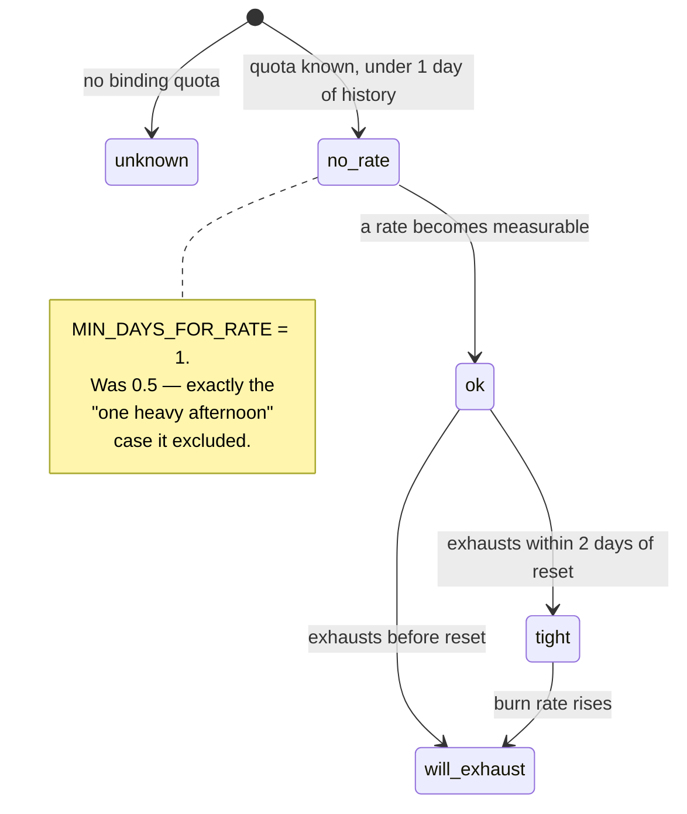

# Architecture

## Data flow



The single red node is deliberate: `purge.ts` is the only component that writes
to a database Token Pie does not own. Everything else opens it
`mode=ro&immutable=1`.

## Why a separate rollup



Rolling up to six dimensions — day, model, workspace, operation, selection,
source — bounds storage and query cost no matter how large the upstream
database grows — and it survives the purge that follows ingest.
The cursor stores span ids *with timestamps* so a pass that counts nothing
still remembers the overlap window; storing a bare list caused a
double-counting bug (see `DECISIONS.md#guards`).

Rate-card statistics live alongside the rollups rather than inside them: the
regression needs per-request variation, which aggregation destroys, so ingest
feeds each request to `observePrice` before `add` folds it away.

**`VERSION` is currently 7.** A mismatch discards the store and re-ingests from
the trace database, which is cheap and correct — bump it on any change to
`Rollup`, `PriceStats`, or anything else persisted alongside them.

Four things live beside the rollups, each for a reason aggregation would
destroy: `prices` (per-model sufficient statistics, which need per-request
variation), `depth` (cost by position in a conversation), `turns` (per-session
ordinals, pruned at 90 days), and `backfilled` (request ids already recovered
from transcripts, so a second pass counts nothing twice).

## Solving the rate card

`copilot_usage_nano_aiu` is one opaque total per request — nothing says how much
of it was input and how much was output. But cost is linear in the three token
classes, and every request is an observation of that line:



On real data this recovers `claude-sonnet-5` as exactly **0.25 fresh / 0.02
cached / 1.00 output** credits per 1k, R² = 1.00000 with four degrees of
freedom — the published rate card, measured rather than assumed.

Two consequences that shape the UI and the advice:

- **Output bills at 4× fresh input and 12.5× cached.** Any composition reported
  by token count misstates cost — output was 2% of tokens and 16% of spend.
- **Only statistics are stored, never requests.** XᵀX and Xᵀy accumulate
  incrementally and `mergeStats` is associative, so this fits the same
  bounded-storage rule as the rollup.

The solve deliberately refuses more often than it answers. A real rate card fits
*exactly*, so R² below 0.999 means the model is wrong — a tier change mid-window,
an unknown token class — not merely noisy. Consumers must handle `undefined`
and say which path they took; both `advice.ts` cards do.

## Why history is thin, and what fills it

`agent-traces.db` is written only from the moment the exporter is switched on
and holds nothing retroactively — on an install with a year of prior Copilot
use it held two and a half hours. `backfill.ts` recovers what VS Code's own chat
transcripts record for days the trace database does not cover, capped at a
rolling 30 days.

Scanning is incremental. Each transcript's size and mtime are recorded in the
store, so one that has not changed since it was last read is never opened
again — across restarts as well, since the record is on disk rather than in
memory. A launch with nothing new costs one `stat` per file instead of parsing
the whole window. Recovered message ids are kept with their day and pruned out
of the window, so neither record grows without bound.

Those days are marked `source: 'reported'` and are **excluded from
`burnPerDay`**. The transcripts omit retried and cancelled messages — roughly a
55% shortfall on agent work — and an undercount in the burn rate tells someone
they are safe when they are about to be cut off. It is a floor shown as
history, never an input to the projection. Most transcripts predate VS Code
recording cost at all, so on many machines it recovers nothing; the panel says
so rather than looking empty.

## The two joins, and what they cost

`agent-traces.db` knows `chat_session_id` and nothing else about context. Both
enrichments come from VS Code's own files:



**Join 1 is exact.** A session file's directory names the workspace.

**Join 2 is approximate, and this is a real limitation.** `spans.turn_index` is
NULL in copilot-chat 0.62.0, so there is no per-turn key. Attribution is at
`(chat_session_id, resolved model)`: exact whenever a model was reached one way
inside a thread, `mixed` when it was not, `unknown` when the span has no
session (background `title` calls). **If a future copilot-chat populates
`turn_index`, switch to a per-turn join and delete the `mixed` case.**

## Load states



## Verdict pipeline



`unknown` and `no-rate` are not failures; they are the honest answer when the
data cannot support a projection. The status bar shows a percentage instead.

## UI rules

The panel is deliberately plain HTML with VS Code theme variables, `enableScripts:
false`, and CSP `default-src 'none'`. Progressive disclosure uses `<details>`,
which needs no script.

- **One hero figure per view.** The number the panel exists to deliver.
- **A meter is a ratio against a limit.** Solid fill = spent, hatched = the
  forecast at current burn. When the forecast overruns, the *track rescales to
  the projection* and a tick marks the allowance — clipping at 100% draws an
  overshoot as a bar that merely fills up, contradicting the number beside it.
- **No chart below two data points.** A one-bar bar chart is always 100% full.
- **Status colours are reserved** for state (`charts-red`/`yellow`), never for
  series identity. Share bars use one hue with emphasis on the leader.
- **Direct-label every row** so colour never carries identity alone.
- **Draw a comparison, do not assert it.** Cost-vs-token composition is a table
  whose two share columns are read off the same rows. The sentence it replaced
  carried two percentages that had drifted onto different denominators; columns
  built from one row list cannot drift that way. Four classes across two
  measures is also more numbers than a stacked bar can label.
- **Name the thing the reader already has a word for.** Composition is grouped
  as *input tokens* (uncached + cached, indented) and *output tokens*. Reporting
  only fresh/cached/output meant "input" never appeared and its share could not
  be read off the page at all. Subtotals carry the shares; children carry their
  own figures without a share bar, so a part is never drawn as a whole.
- **One centred column, 860px.** Everything below the verdict is one flow; the
  breakdowns sit inside a disclosure that is open by default and can be folded.
- **A section heading above a table is the table's first column header.** A
  standalone `<h2>` over a header row whose first cell is empty (or repeats the
  heading) floats free of the thing it names.
- **Lead with consequences, not categories.** "What your habits cost" sits above
  the breakdowns: cost per warm turn by thread depth, the average cost of a
  request, and how many requests the remaining allowance buys. A per-1k rate
  column was tried here and removed — it is the unit a billing system uses, not
  one any developer thinks in.
- **Exclude cold starts from the depth trend.** A first request to a model pays
  for the whole context at full price and would swamp the very trend the chart
  exists to show.
- **Series hues in fixed order: blue → green → purple.** Blue adjacent to purple
  fails CVD separation (ΔE 5.6 protan, below even the conditional floor);
  reordering so green sits between them clears it at ΔE 20.9. Validated with
  the dataviz skill's `validate_palette.js` against VS Code's default dark
  chart tokens. `charts.red` and `charts.yellow` stay reserved for the verdict.
  The lightness-band check still fails and cannot be fixed without abandoning
  theme variables, which would break every non-default theme — a deliberate
  trade, not an oversight.
- **Every credit must appear.** Spend on models without a rate card is a
  hatched fourth segment, not an omission.
- **Never `$(copilot)`.** See `DECISIONS.md#attribution`.

## Previewing the panel

`renderReport` is pure — it takes data and returns a string, with no `vscode`
import. Render it headless rather than launching an Extension Development Host:

```bash
npm run compile
node -e "
  const { renderReport } = require('./out/report.js');
  require('fs').writeFileSync('/tmp/p.html', renderReport({
    rollups: [/* … */], creditsPerNanoAiu: 1e-9, dbCount: 1,
    lastRefresh: new Date(), costCoverage: 1, warnings: [], projection: {/* … */}
  }));"
"/Applications/Google Chrome.app/Contents/MacOS/Google Chrome" \
  --headless --disable-gpu --screenshot=/tmp/p.png \
  --window-size=1600,900 --hide-scrollbars /tmp/p.html
```

Inject a `:root` block defining the `--vscode-*` variables first, or the page
renders unstyled. **Then open the PNG and look at it.**

## Upstream schema (copilot-chat 0.62.0, `schema_version` 1)

`spans` — `span_id, trace_id, parent_span_id, name, start_time_ms, end_time_ms,
status_code, status_message, operation_name, provider_name, agent_name,
conversation_id, request_model, response_model, input_tokens, output_tokens,
cached_tokens, reasoning_tokens, tool_name, tool_call_id, tool_type,
chat_session_id, turn_index, ttft_ms`

`span_attributes` — `span_id, key, value`. Cost lives here, not on the span row:
`copilot_chat.copilot_usage_nano_aiu`.

Notes that matter:

- `input_tokens` is the **total**, with `cached_tokens` a subset of it.
- `operation_name` is one of `chat`, `invoke_agent`, `execute_tool`. Only `chat`
  is billable; `invoke_agent` repeats its child's counts.
- `agent_name` separates your turns (`panel/editAgent`) from work Copilot does
  on your behalf (`title`, `progressMessages`).
- Version this against `KNOWN_SCHEMA_VERSION` in `schema.ts`. The upstream
  schema is not a stable contract.
