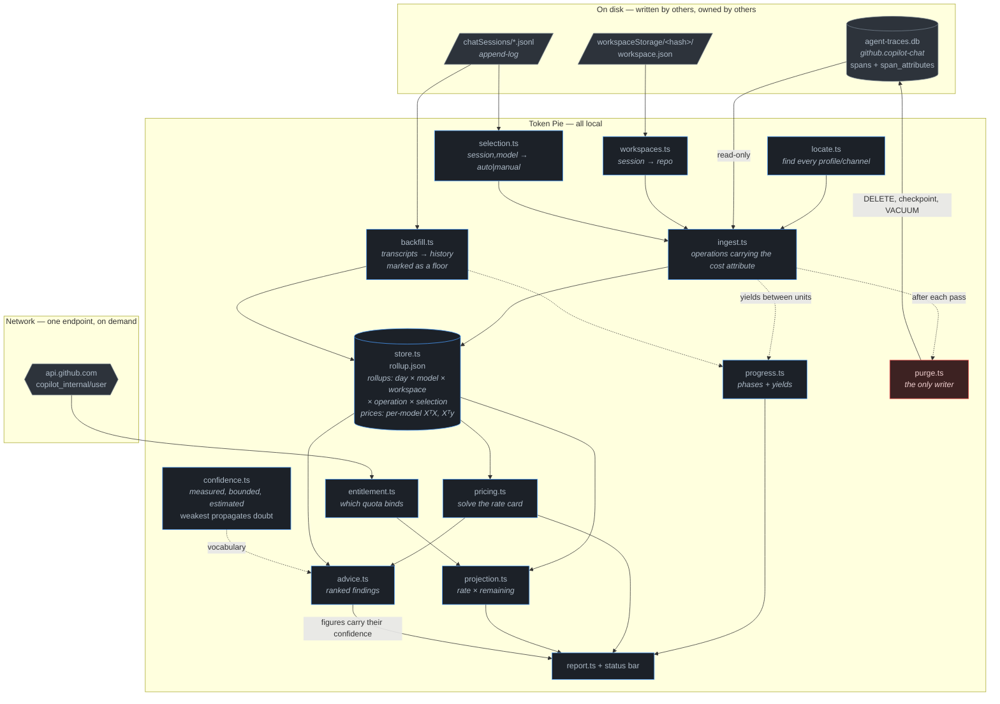
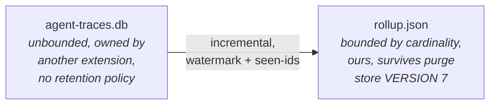
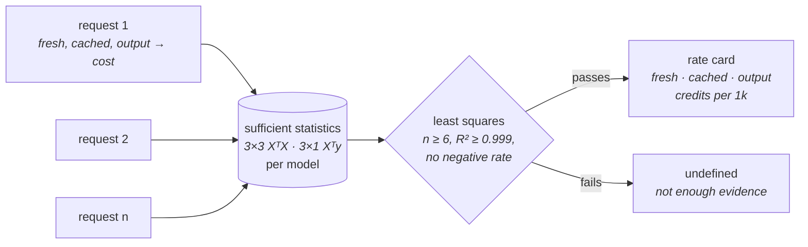
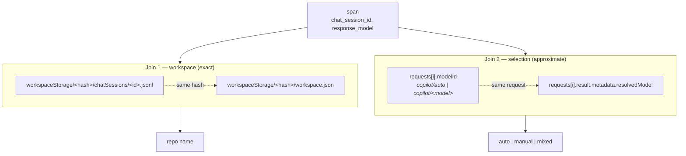
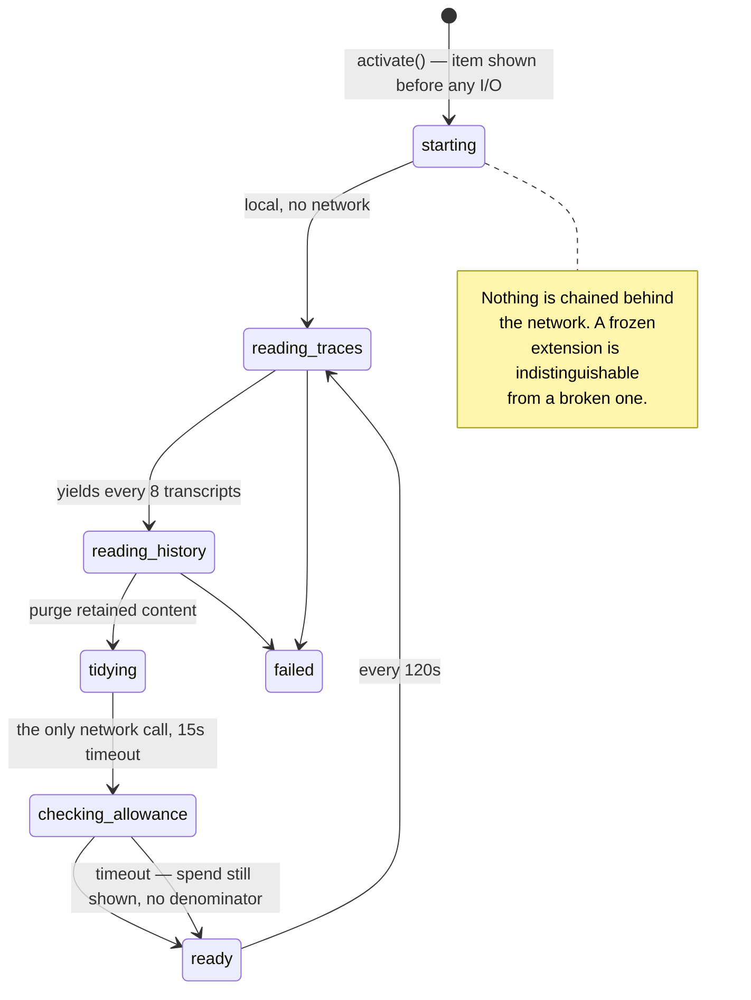
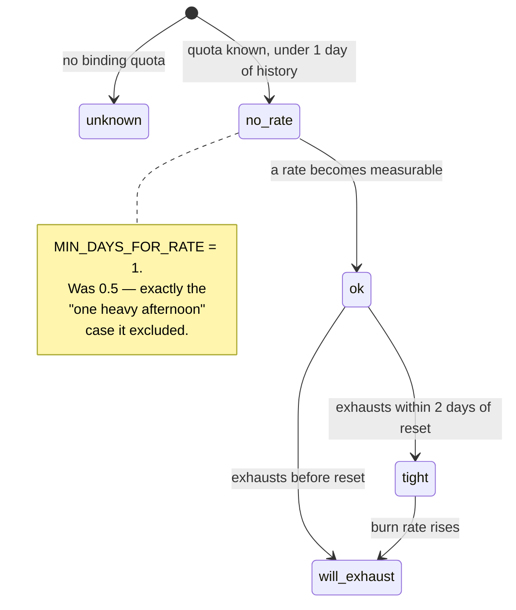

# Architecture

## Data flow



The single red node is deliberate: `purge.ts` is the only component that writes
to a database Token Pie does not own. Everything else opens it
`mode=ro&immutable=1`.

## Why a separate rollup



Rolling up to six dimensions — day, model, workspace, operation, selection,
source — bounds storage and query cost no matter how large the upstream
database grows — and it survives the purge that follows ingest.
The cursor stores span ids *with timestamps* so a pass that counts nothing
still remembers the overlap window; storing a bare list caused a
double-counting bug (see `DECISIONS.md#guards`).

Rate-card statistics live alongside the rollups rather than inside them: the
regression needs per-request variation, which aggregation destroys, so ingest
feeds each request to `observePrice` before `add` folds it away.

**`VERSION` is currently 7.** A mismatch discards the store and re-ingests from
the trace database, which is cheap and correct — bump it on any change to
`Rollup`, `PriceStats`, or anything else persisted alongside them.

Four things live beside the rollups, each for a reason aggregation would
destroy: `prices` (per-model sufficient statistics, which need per-request
variation), `depth` (cost by position in a conversation), `turns` (per-session
ordinals, pruned at 90 days), and `backfilled` (request ids already recovered
from transcripts, so a second pass counts nothing twice).

## Solving the rate card

`copilot_usage_nano_aiu` is one opaque total per request — nothing says how much
of it was input and how much was output. But cost is linear in the three token
classes, and every request is an observation of that line:



On real data this recovers `claude-sonnet-5` as exactly **0.25 fresh / 0.02
cached / 1.00 output** credits per 1k, R² = 1.00000 with four degrees of
freedom — the published rate card, measured rather than assumed.

Two consequences that shape the UI and the advice:

- **Output bills at 4× fresh input and 12.5× cached.** Any composition reported
  by token count misstates cost — output was 2% of tokens and 16% of spend.
- **Only statistics are stored, never requests.** XᵀX and Xᵀy accumulate
  incrementally and `mergeStats` is associative, so this fits the same
  bounded-storage rule as the rollup.

The solve deliberately refuses more often than it answers. A real rate card fits
*exactly*, so R² below 0.999 means the model is wrong — a tier change mid-window,
an unknown token class — not merely noisy. Consumers must handle `undefined`
and say which path they took; both `advice.ts` cards do.

## Why history is thin, and what fills it

`agent-traces.db` is written only from the moment the exporter is switched on
and holds nothing retroactively — on an install with a year of prior Copilot
use it held two and a half hours. `backfill.ts` recovers what VS Code's own chat
transcripts record for days the trace database does not cover, capped at a
rolling 30 days.

Scanning is incremental. Each transcript's size and mtime are recorded in the
store, so one that has not changed since it was last read is never opened
again — across restarts as well, since the record is on disk rather than in
memory. A launch with nothing new costs one `stat` per file instead of parsing
the whole window. Recovered message ids are kept with their day and pruned out
of the window, so neither record grows without bound.

Those days are marked `source: 'reported'` and are **excluded from
`burnPerDay`**. The transcripts omit retried and cancelled messages — roughly a
55% shortfall on agent work — and an undercount in the burn rate tells someone
they are safe when they are about to be cut off. It is a floor shown as
history, never an input to the projection. Most transcripts predate VS Code
recording cost at all, so on many machines it recovers nothing; the panel says
so rather than looking empty.

### A floor says it is a floor

Excluded from `burnPerDay` was the only place the distinction was honoured.
The panel's own totals added `measured` and `reported` and said nothing, so a
machine whose trace database yielded nothing showed "862 credits over 31
messages" as though it were a measurement, under a footer naming the cost
record it had never read. `sourceNote()` now states the split, and the footer
names whichever source the figures actually came from.

## What this machine could have seen

Reconciling our total against GitHub's is only honest over days this machine
was recording. `reconcile.ts` used to judge that by where local history
starts — which backfill pushes back thirty days, proving nothing was
*measured*. On a machine that began tracing on the 27th, history started on
the 30th of the previous month, before the billing period did, so the check
meant to catch exactly that passed and a shortfall of 19,094 credits was
reported as spend on other machines.

Only the trace database bounds what could have been seen, so `periodCoverage`
takes `traceStartMs` and judges the share of the elapsed period it was running
for. Below `reconcile.minRecordedShare` the verdict is inconclusive and the
note names the cause: days never watched, not spend elsewhere. A machine with
no trace database at all is its own case.

## One model, however it is spelled

The same model arrives under several spellings depending on which field
carried it — `copilot/claude-opus-4.6` from the request, `claude-opus-4-6`
from the response, `aitk-foundry/Microsoft Foundry/(AK-AIF)gpt-5.6-luna` where
a gateway prefixed its own routing twice. Everything up to the last slash is a
route and a leading parenthetical is a deployment label; neither is what
answered the call.

`modelKey()` in `ratecard.ts` folds them; `bareModel()` gives the label. Group
on the key, never the raw string — doing so made one model two rows whose
shares each looked like half the truth, and left the price lookup unable to
find a prefixed name at all.

## Day keys are local days

`dayKey()` builds day strings from `getFullYear/getMonth/getDate`, so a day
key is a **local** calendar day. Parse it back with `dayStartMs()` from
`store.ts`. Four places used to append a `Z` and four did not, putting the same
day up to a timezone offset apart depending on which parser saw it — a
billing-period boundary in one, a burn-rate denominator in another. In UTC the
two agree, so the disagreement was invisible on every developer machine and
appeared the first time the release workflow ran.

Reset dates really are UTC instants from GitHub and are parsed as such. The
date-arithmetic tests pin `process.env.TZ` before importing what they
exercise, because where local midnight falls genuinely moves a horizon and a
fixture asserting "6h left" has to say which zone it means.

## The two joins, and what they cost

`agent-traces.db` knows `chat_session_id` and nothing else about context. Both
enrichments come from VS Code's own files:



**Join 1 is exact.** A session file's directory names the workspace.

**Join 2 is approximate, and this is a real limitation.** `spans.turn_index` is
NULL in copilot-chat 0.62.0, so there is no per-turn key. Attribution is at
`(chat_session_id, resolved model)`: exact whenever a model was reached one way
inside a thread, `mixed` when it was not, `unknown` when the span has no
session (background `title` calls). **If a future copilot-chat populates
`turn_index`, switch to a per-turn join and delete the `mixed` case.**

## Load states



### Faults and findings

The status bar sends its click to the log rather than the report whenever
`lastErrors` is non-empty, and shows the broken mark. That is right for a
fault and wrong for a finding: reading a database perfectly and discovering it
holds nothing billable is not a degraded install, and filing it as one made
the panel unreachable on the single machine that most needed to read it.

`IngestResult` carries `notices` beside `errors`. Both reach the reader — as
panel warnings and in Token Specs — and only `errors` degrades the item. When
adding a message, ask whether the extension failed or the data disappointed.

## Today's budget

The month figure is a fact until the reset; today's is the only one an
afternoon can still move. It is a share of what today was allowed to cost:

```
tokenPie.dailyBudget set:  entitlement x percent
              otherwise:  (remaining + spent today) / whole days left
```

Three things about the default, each of which was wrong first:

- **Today's spend is added back.** `remaining` already has it deducted, so
  dividing by it shrank the budget as the spend against it grew, and the ratio
  ran ahead by `days / (days - 1)`. Spending exactly the sustainable amount
  reported 111% used over ten days and 159% over three. A budget that recedes
  as you spend cannot be spent to the line.
- **Whole days, not `daysToReset`.** That figure is continuous and falls all
  day, so the same 100 credits read as 30% used at 1am and 20% at 11pm. Days
  are counted between local midnights, so the boundary is the reader's idea of
  "today" rather than the hour the allowance happens to renew.
- **Only measured spend counts.** Backfill is a floor, and a budget checked
  against a floor reports room that may not be there.

`sustainableDailyBurn` is deliberately *not* this number. "The pace that lasts
from here" is right for the tile that shows it and wrong for a line you spend
against; they were one expression and had to stop being one.

The panel carries the derivation in a `details` beside the figure, with the
account's own numbers in it — the first thing asked of a bare 539 was what it
meant. `details` rather than a hover because the webview runs with scripts
disabled, and a `title` attribute cannot be read by a keyboard.

## Verdict pipeline



`unknown` and `no-rate` are not failures; they are the honest answer when the
data cannot support a projection. The status bar shows a percentage instead.

## UI rules

The panel is deliberately plain HTML with VS Code theme variables, `enableScripts:
false`, and CSP `default-src 'none'`. Progressive disclosure uses `<details>`,
which needs no script.

- **One hero figure per view.** The number the panel exists to deliver.
- **A meter is a ratio against a limit.** Solid fill = spent, hatched = the
  forecast at current burn. When the forecast overruns, the *track rescales to
  the projection* and a tick marks the allowance — clipping at 100% draws an
  overshoot as a bar that merely fills up, contradicting the number beside it.
- **No chart below two data points.** A one-bar bar chart is always 100% full.
- **Status colours are reserved** for state (`charts-red`/`yellow`), never for
  series identity. Share bars use one hue with emphasis on the leader.
- **Direct-label every row** so colour never carries identity alone.
- **No pooled per-token rate beside the models.** The composition table can
  carry a price because each of its rows is a single price class. A per-model
  figure cannot: it blends fresh, cached and output in whatever proportion this
  developer happened to use. Measured on real data, `claude-sonnet-5` came out
  at 0.051 credits per 1k against `gpt-5.6-terra`'s 0.155 — which reads as
  "terra is 3x dearer" when sonnet's cache was 92% warm and terra's 49%. Most of
  the gap is cache warmth, not the price list. It would look like a property of
  the model and be a property of the month. The by-model table carries **token
  counts** instead, which are a fact rather than a comparison, and the
  like-for-like comparison stays in `counterfactual()`, which re-prices the same
  basket at the other model's measured rates.
- **A repeated column header is not a header.** The composition table carried
  two columns both called *Share*, leaving position as the only clue to which
  measure each belonged to. Each now names its own denominator — **% of spend**
  and **% of text** — and the token one borrows the caption's word, so a row
  reads as *62% of spend, 82% of text*. The by-model and by-project tables keep
  a single `Share`: with one measure there is nothing to confuse it with.
- **Show the price, not only the volume and the cost.** The table had tokens and
  credits and nothing between them, so the reader had to divide one column by
  the other to find out why 1% of the tokens is 21% of the bill — and the naive
  reading is the wrong way round, because input costs three times more *in
  total* while costing a quarter as much *per token*. A **Per token** column
  states it as a multiple of fresh input: `1x`, `0.08x`, `4x`. Derived from the
  figures in the same row, so any of them can be checked by dividing the columns
  either side, and absent on rows that blend two rates — a weighted average of
  prices is not a price. This is not the per-1k rate column that was removed: a
  rate is the unit a billing system thinks in, a multiple is one a person can
  hold.
- **Draw the comparison, then name it.** The two share columns let the reader
  see that replies are 1% of the tokens and 21% of the credits — but only if
  they stop and compare. The note beneath now states the multiple outright: *a
  token Copilot writes costs 4× one you send new and 50× one it reads back from
  cache*, computed from this machine's own solved card. That is not a
  reinstatement of the per-1k rate column below: a rate is the unit a billing
  system thinks in, a multiple is the unit a person does. It is also what makes
  the thinking figures legible — thinking is output, and output is the
  expensive class.
- **Draw a comparison, do not assert it.** Cost-vs-token composition is a table
  whose two share columns are read off the same rows. The sentence it replaced
  carried two percentages that had drifted onto different denominators; columns
  built from one row list cannot drift that way. Four classes across two
  measures is also more numbers than a stacked bar can label.
- **Name the thing the reader already has a word for.** Composition is grouped
  as *input tokens* (uncached + cached, indented) and *output tokens*. Reporting
  only fresh/cached/output meant "input" never appeared and its share could not
  be read off the page at all. Subtotals carry the shares; children carry their
  own figures without a share bar, so a part is never drawn as a whole.
- **One centred column, 860px.** Everything below the verdict is one flow; the
  breakdowns sit inside a disclosure that is open by default and can be folded.
- **A section heading above a table is the table's first column header.** A
  standalone `<h2>` over a header row whose first cell is empty (or repeats the
  heading) floats free of the thing it names.
- **A rate is not a reason.** The depth chart sat at the top of *What to change*
  showing credits-per-message by position, and restated in four rows exactly
  what the sentence beneath it said in one. Worse, cost-per-message cannot say
  whether the habit is worth changing — a 3.6× multiple on messages you rarely
  send is worth ignoring. The sentence now carries the *share of spend* in the
  deep bucket (the size of the lever), and the per-bucket table moved into
  *Where the credits went*, which is where breakdowns live. The top of the
  section carries the action; the evidence sits with the other evidence.
- **A per-bucket mean needs `MIN_BUCKET_REQUESTS`.** The only guard was
  `warmRequests > 0`, so one message could anchor either end of the ratio — a
  "3.6×" was being stated from two observations against two.
- **Lead with consequences, not categories.** "What your habits cost" sits above
  the breakdowns: cost per warm turn by thread depth, the average cost of a
  request, and how many requests the remaining allowance buys. A per-1k rate
  column was tried here and removed — it is the unit a billing system uses, not
  one any developer thinks in.
- **Exclude cold starts from the depth trend.** A first request to a model pays
  for the whole context at full price and would swamp the very trend the chart
  exists to show.
- **Series hues in fixed order: blue → green → purple.** Blue adjacent to purple
  fails CVD separation (ΔE 5.6 protan, below even the conditional floor);
  reordering so green sits between them clears it at ΔE 20.9. Validated with
  the dataviz skill's `validate_palette.js` against VS Code's default dark
  chart tokens. `charts.red` and `charts.yellow` stay reserved for the verdict.
  The lightness-band check still fails and cannot be fixed without abandoning
  theme variables, which would break every non-default theme — a deliberate
  trade, not an oversight.
- **Every credit must appear.** Spend on models without a rate card is a
  hatched fourth segment, not an omission.
- **Say which numbers are not measurements.** Three kinds of figure appear on
  this panel and they must not look alike: a measurement read from telemetry, an
  upper *bound* on a saving, and an *estimate* that rests on an inferred
  conversion or an inferred ordering. `confidence.ts` gives them a shared
  vocabulary; `weakest()` combines it, so a total built on an estimated input is
  estimated no matter how exact its other inputs were. The mark is a prefix
  (`≤`, `~`) plus the reason as a tooltip, never colour alone — and never a
  generic disclaimer, which only teaches the reader to stop reading marks.
- **Absent beats badged.** A figure with too little behind it is withheld, not
  labelled. Confidence says *the method may be wrong*; a threshold says *this
  number has nothing behind it yet*. Badging thin data too makes the mark
  wallpaper and disarms it on the cases that need it.
- **Control prose length by writing less, not by capping the width.** Capping a
  card body at 82ch was tried and reverted: the text stopped two-thirds across a
  bordered box, and a block that does not fill its container reads as a bug
  rather than a measure. Body text fills the card, and the remedies were cut to
  three lines instead of five. A measure is only used where the text is centred
  and therefore has no left edge to betray it. Nothing currently qualifies: the
  footer was centred on a measure and reverted, because it was then the only
  block on the page not lined up with the column.
- **Measure before believing a layout complaint.** The footer was reported twice
  as "not filling the width". It had no width constraint: measured, the box was
  the full 860px and its first line reached 934 of a 960px content edge. The
  short second line was a single unbreakable monospace token
  (`tokenPie.creditsPerNanoAiu`) forcing an early break. The fix was shorter
  prose, not CSS. `Range.getClientRects()` on a CSP-stripped copy of the
  preview gives per-line extents.
- **Every link leaves.** A webview is not a browser tab: navigating it away
  replaces the panel with the destination and there is no back button to return
  with. Links carry `target="_blank"` and `rel="noopener noreferrer"`, so VS Code
  hands them to the user's own browser and the opened page cannot reach back
  through `window.opener`. Pinned by a selftest that walks every `<a>` in the
  rendered panel, so a link added later cannot skip it.
- **One word for the unit.** `cr` and `credits` were both in use — *"1,477 cr
  left"* beside *"23.04 credits"* — which reads as two different units to anyone
  who has not read the source. Everything says **credits** now, pluralised on
  the formatted value. A selftest strips the tags and fails on any figure
  followed by `cr`.
- **One mark, three places.** `images/icon.svg` is the source the Marketplace
  icon is generated from; the panel redraws the same three slices inline, and
  the report's editor tab takes `icon.png` via `WebviewPanel.iconPath`. The
  panel version substitutes theme variables for the file's hex, so it holds up
  in a light theme, and a selftest compares the two path sets **numerically** —
  the file writes `86.0` and `-0.00` where the panel writes `86` and `0`.
  Its `viewBox` is cropped to `42 42 172 172`, the pie's own extent: the source
  box is 256 wide for a radius-86 pie, so two thirds of it is padding and the
  mark drew at ~10px inside a 15px square before the crop.
  The status bar is the exception and cannot be fixed: its label accepts
  codicons only, so `$(pie-chart)` stays the closest available match.
- **A flex container's baseline is its first item's.** `<h1>` was `inline-flex`
  to sit the logo beside the title, which made the heading's baseline the
  *logo's bottom edge* rather than the text's — so `<header>`'s
  `align-items: baseline` pinned the date to the image, and every increase in
  logo size pushed the date further out of line. The heading is ordinary inline
  content now, with the logo optically aligned via `vertical-align: -0.28em`.
  Verified by measuring both text rects: 1px apart, exactly the descender
  difference between 1.1rem and 0.82rem.
- **Align to the block, not the first line.** `.verdict-top` used
  `align-items: baseline`, which was right while the hero sat beside a single
  sentence. Once that column carried the sentence *and* the note, a baseline
  pinned the figure to the first line and stranded it at the top of a taller
  block; it is centred against the column now.
- **A definition goes before the figures it defines.** Every figure is
  denominated in credits and nothing said what one was. The note gives the
  definition, the dollar value and a link to GitHub's own page, and it sits
  under the verdict sentence inside the first card — not as a paragraph above
  the card, and not beside the pace tiles.

  The tile row was tried first because it is free: tiles are `flex: 0 1 auto`,
  so they leave most of that row empty while standing exactly the note's height.
  It cost 0px, but it put the definition *after* the meter had already said
  "1,500 credits used", and parked it where it read as a caption for YOUR PACE.
  Measured across all three: 1507px standalone, 1444px beside the tiles, 1478px
  under the sentence. The 34px buys correct reading order and is still 29px
  better than the paragraph it replaced — cheapest is not the same as right.

  The history window is stated as a maximum — *up to* 30 days — never as a claim
  that 30 days of data exist; see `historyNote`.
- **Reference before recommendations.** *Where the credits went* sits above
  *What to change*: advice about spend you have not seen yet is not actionable.
  Nothing is expanded on arrival, so the reader chooses what to open rather than
  being handed one card already unfolded.
- **A disclosure is one region, header and body.** The breakdown put its border
  on the `summary` alone, so its tables spilled out underneath with no
  container and the header looked detached from what it opened. The border and
  background belong on the `details`, with the body in its own padded `div` —
  the way `.card` was already built.
- **Close a section, do not just head it.** An `<h2>` wraps nothing, so the
  breakdown was a bare sibling of the advice cards under one heading. Once both
  disclosures shared their chrome, nothing was left to say the breakdown was
  reference rather than a third recommendation. Recommendations and reference
  are now separate `<section>` elements, 38px apart, each with its own heading —
  and the heading names the section while the summary carries the total, so
  neither repeats the other.
- **Every disclosure looks the same and says so.** Advice cards and the
  breakdown are both `<details>`, and they had different padding, type sizes and
  marker glyphs — they read as unrelated components. Both now share the chrome
  and one chevron, drawn with borders on a rotated box rather than typed as
  `\25B8`: a glyph at 0.75em was too faint to read as a control, and a drawn one
  takes the current text colour at any size with no font dependency. It rotates
  down-to-up on open.
- **Separate with margin, not a rule.** A horizontal rule needs padding on both
  sides to clear it, so it costs more vertical space than the separation is
  worth, and it doubles up against a table that already has a bottom border.
  Rules above the evidence block and the footer were both tried and removed.
- **Bordered blocks need more than 8px between them.** Cards sit 12px apart and
  20px below the prose that introduces them; a paragraph that runs straight into
  a table header, or a note that runs into the next table, reads as one element
  rather than two. The composition block carries its own bottom margin for
  exactly this reason.
- **Advice clears one of two floors, not both.** A finding shows if it is
  *urgent* (≥1% of the remaining allowance) **or** a *pattern* (≥0.5 credits and
  ≥5% of observed spend). Requiring urgency alone silenced every card on an
  account with a large allowance and ordinary spend. Separately,
  `MIN_HISTORY_REQUESTS` withholds all advice below ten requests — not enough
  history to call anything a habit. See `DECISIONS.md#materiality`.
- **Never `$(copilot)`.** See `DECISIONS.md#attribution`.

## Releasing

```bash
npm run release       # the commits choose the version; the hooks write the notes
# read the new section in CHANGELOG.md and improve the prose if it needs it
npm run build         # clean, compile, test, package, preflight, audit
git push && git push --tags
```

The version is a **function of the log**, not a judgement call. Every commit
since the last tag carries a type the hook enforced, so the bump follows:

| in the log | bump |
|---|---|
| `BREAKING CHANGE:` footer, or `!` after the type | major |
| `feat` | minor |
| `fix`, `perf`, `revert` | patch |
| `chore`, `docs`, `test`, `refactor`, `ci`, `build`, `style` | none — nothing to release |

Choosing it by eye is how 0.2.1 shipped with features in it under a patch bump.
`scripts/release.mjs` reads the range, prints every user-facing commit with the
level it demands, and hands the result to `npm version`. `--dry-run` shows the
decision without taking it.

**Major zero holds breaking at a minor.** SemVer says anything may change while
the major is 0, so a `feat!` at 0.x is not the milestone that 1.0.0 announces —
it bumps to 0.4.0, and `npm run release -- --major` is how you declare 1.0.0 on
purpose. This is the one deliberate departure from `semantic-release`, which
promotes on the first breaking change.

`npm version` stays the mechanism, not something wrapped away. It already bumps
`package.json`, both `package-lock.json` fields, and creates the commit and tag.
A bespoke `npm run bump` was written first and removed: it duplicated all of
that slightly worse, and — the failure that mattered — it was the thing you had
to remember to use *instead of* the standard command. So `npm version 1.0.0` by
hand still works, and still gets its notes; `npm run release` only chooses the
number.

Two lifecycle hooks fill the gaps npm leaves:

| hook | does |
|---|---|
| `preversion` | runs the suite, so a failing tree cannot be versioned |
| `version` | writes the `CHANGELOG.md` section from the commits and `git add`s it |

The hook runs after the bump and before the commit, so `lastTag..HEAD` is
exactly the work being released. It also asks the Marketplace what is live and
warns if the new version is not ahead of it — advisory only; being offline never
blocks a bump.

### Conventional commits

Enforced by `.githooks/commit-msg`, not by habit, so it does not matter who is
committing:

```bash
git config core.hooksPath .githooks   # once per clone; git does not clone hooks
```

The type prefix is not tidiness. It is the input to both the version and the
notes, which is why the hook rejects a subject without one rather than warning.
`scripts/conventional.mjs` holds the parse, the level mapping and the renderer
in one place, so the audit cannot disagree with the bump about which commits
were user-facing.

### Generated notes, edited afterwards

The section arrives populated and grouped — Breaking, Added, Fixed, Faster,
Reverted — with the scope as the bold lead where a commit had one.

A generated list of commit subjects is still a worse artefact than prose written
on purpose, and this changelog is the Marketplace release notes, the first thing
a prospective user reads. That argued for years against generating it at all,
and the argument was wrong in one specific way: the empty stub it justified is
the step that got skipped. 0.3.0 was tagged with a heading and nothing under it.
A generated draft that someone rewrites is strictly better than a blank one
someone forgets, because the failure mode is a rough line rather than no line.

So generation is the floor, not the ceiling. Edit the section before building —
merge churn that cancelled out, promote the one entry that matters, write the
bold lead. 0.3.0 had a sidebar added and reverted inside the same release; both
lines generated, and neither belongs in notes a user reads.

### Publish gates versus package gates

Most of preflight is about the artefact, and an artefact can be wrong the
moment it is built. A few checks are not: the listing images are served from
`main`, so a screenshot regenerated locally but not pushed harms nobody until
someone reads the Marketplace page.

Failing the build on those made a circle. Taking a new screenshot needs a
`.vsix` to install; building the `.vsix` refused until the screenshot was
pushed; the screenshot could not be pushed before it was taken.

So `gate()` warns where `check()` fails, and promotes to a failure under
`--publish` or `CI`. The default is what you want while iterating, and CI is
strict for free — a tag being built there is already pushed, and its green run
is what a Release is created from.

```bash
npm run build              # warns on the publish gates
npm run build -- --publish # fails on them
```

The build prints every warning in full rather than counting them, and drops
"Ready to publish" when there are any: a line that says it anyway is a line
worth ignoring.

### GitHub Releases

`.github/workflows/release.yml`, on any `v*` tag. Pushing the tag is the last
manual step of a release, so the workflow starts there: it runs `npm run build`
in full — the same seven stages — and only then creates the Release. A tag whose
tests, preflight or audit fail produces **no Release at all** rather than one
nobody verified.

The body is `scripts/release-notes.mjs`, which reads the section the version
hook already wrote, so the Release and the Marketplace listing cannot say
different things. It exits non-zero on an entry with no prose: a Release is the
artefact people subscribe to, and a blank one cannot be un-sent.

`scripts/changelog.mjs` holds that lookup, because three things ask it —
preflight for the empty-stub check, the audit for its bullet count, the
workflow for the body — and each had its own copy of a split that had already
been wrong once. Matching to a lookahead, `(?=^## |$)` with the `m` flag ends at
the first line break, so the capture came back empty and preflight passed a good
entry for the wrong reason.

The workflow checks out with `fetch-depth: 0`; the audit runs `git describe`
against the previous tag and a shallow clone has neither the tags nor the
commits it counts. It also verifies the tag name against `package.json` before
building, since a mismatch would attach a `.vsix` whose filename disagrees with
the Release. `workflow_dispatch` takes a tag name, which is how a tag pushed
before the workflow existed gets its Release.

**Not published from CI.** `vsce publish` needs a PAT and cannot be taken back.
This workflow needs no secret beyond the token Actions issues itself, and a
Release can be deleted.

### The release audit

`scripts/release-audit.mjs`, a build stage. Preflight proves a changelog section
exists and has prose in it; it cannot prove the prose is *complete*, and that is
the failure that actually happened — entries kept being appended to a version
already published, because nothing said that section was closed. The version and
the changelog drifted in content before they drifted in number.

The question has a mechanical form: how many user-facing commits since the last
tag, against how many bullets under the current heading. It fails outright on
user-facing commits with nothing written, and notes when there are fewer bullets
than commits — which is now a signal that someone edited the generated section,
and worth a glance rather than an alarm. It cannot verify a word of the prose.

## Diagnosing a panel that looks wrong

`scripts/diagnose.mjs` prints what the panel is adding up: every day with its
**year**, the split by `source`, the two sides of the billing-period boundary,
and model labels grouped by `modelKey()` so ones that are a single model
appear as such.

It reads the saved `rollup.json` rather than `agent-traces.db` — that is
exactly what the panel renders from, it needs no database access, and it runs
on a machine with the extension from the Marketplace and no checkout. One
file, plain `node`, nothing installed:

```bash
node scripts/diagnose.mjs --since 2026-08-01
node scripts/diagnose.mjs --file <a rollup.json from another machine>
```

Workspace names are the only field that could carry anything private and are
deliberately not printed, so its output can be pasted into an issue.

It exists because a machine showed "862 credits over 31 messages" and, one
line below, "this machine accounts for 20.48". Both came from the same
rollups and the same conversion; only a date filter separated them, and
nothing on the page said which days fell on which side of it.

## Previewing the panel

`renderReport` is pure — it takes data and returns a string, with no `vscode`
import. So the panel can be rendered from a plain shell, and there are two ways
to do it that answer **different questions**.

### From this machine's real rollup

```bash
npm run preview            # opens the panel in a browser, dark
npm run preview -- --light
npm run why                # why each recommendation did or did not appear
npm run preview -- --file <rollup.json>
```

`scripts/preview.mjs` reads `rollup.json` out of globalStorage and renders it
through the real `renderReport`, with the allowance taken from
`quota-readings.json` where one exists.

**This is the one that catches an empty section.** Fixture rendering asks "does
the renderer work"; only real data asks "does anything appear on *my* account".
An advice floor once suppressed every card on a live seat with no test failing,
because every fixture cleared it. `npm run why` prints the gate arithmetic —
history floor, both materiality bars, and the stake of each finding against
them — so a missing card is diagnosed rather than inferred from a screenshot.

The preview defines the `--vscode-*` variables the webview normally inherits,
and **fails if the stylesheet uses one the preview does not define**, since an
undefined variable falls back to a browser default and quietly misrepresents the
panel.

### From fixture data

For a shape the real rollup does not contain — an exhausted quota, a
15-model account — construct the input inline:

```bash
npm run compile
node -e "
  const { renderReport } = require('./out/report.js');
  require('fs').writeFileSync('/tmp/p.html', renderReport({
    rollups: [/* … */], creditsPerNanoAiu: 1e-9, dbCount: 1,
    lastRefresh: new Date(), costCoverage: 1, warnings: [], projection: {/* … */}
  }));"
"/Applications/Google Chrome.app/Contents/MacOS/Google Chrome" \
  --headless --disable-gpu --screenshot=/tmp/p.png \
  --window-size=1600,900 --hide-scrollbars /tmp/p.html
```

Inject a `:root` block defining the `--vscode-*` variables first, or the page
renders unstyled. **Then open the PNG and look at it.**

## Upstream schema (copilot-chat 0.62.0, `schema_version` 1)

`spans` — `span_id, trace_id, parent_span_id, name, start_time_ms, end_time_ms,
status_code, status_message, operation_name, provider_name, agent_name,
conversation_id, request_model, response_model, input_tokens, output_tokens,
cached_tokens, reasoning_tokens, tool_name, tool_call_id, tool_type,
chat_session_id, turn_index, ttft_ms`

`span_attributes` — `span_id, key, value`. Cost lives here, not on the span row:
`copilot_chat.copilot_usage_nano_aiu`.

Notes that matter:

- `input_tokens` is the **total**, with `cached_tokens` a subset of it.
- `operation_name` is usually one of `chat`, `invoke_agent`, `execute_tool`,
  `embeddings`. Only the LLM call is billable; `invoke_agent` repeats its
  child's counts, so counting every span with tokens doubles every agent turn.
  **Do not hardcode `chat`** — a work machine held the other three and no
  `chat` at all, and a hardcoded filter matched nothing while
  `MIN(start_time_ms)`, which is unfiltered, still reported when recording
  began. `ingest.ts` asks which operation names carry
  `copilot_usage_nano_aiu` and uses those: only the billable span carries it,
  which is what distinguished it from the wrapper all along.
- `agent_name` separates your turns (`panel/editAgent`) from work Copilot does
  on your behalf (`title`, `progressMessages`).
- Version this against `KNOWN_SCHEMA_VERSION` in `schema.ts`. The upstream
  schema is not a stable contract.
